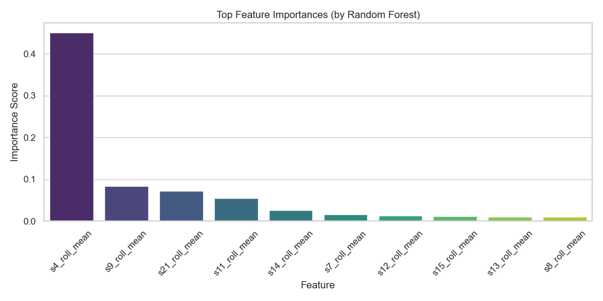

# Predictive Maintenance Model for Aircraft Engines

A machine learning pipeline to predict **Remaining Useful Life (RUL)** of aircraft engines using NASA's C-MAPSS dataset. The project demonstrates a full ML lifecycle: from data ingestion, feature engineering, model training, evaluation, inference, and visualization — culminating in an automated PDF report.

---

## Project Structure

```
.
├── CMaps/                         # Folder with training/test datasets (NASA C-MAPSS)
├── inference.py                  # Inference pipeline for new/test data
├── model_training.py             # Full ML pipeline for training and evaluation
├── scaler.pkl                    # Saved standard scaler used during preprocessing
├── rul_model.pkl                 # Trained RandomForest model
├── predicted_rul.csv             # Predictions from inference.py
├── engine_rul_report.pdf         # Auto-generated report with plots and results
├── rolling_stats_plots/         # Sensor rolling mean/std plots
├── evaluation_plots/            # RUL prediction evaluation plots
├── timeline_plots/              # RUL over time for selected engines
└── README.md                     # You're here!
```

---

## What This Project Does

* **Trains a Random Forest Regressor** to predict RUL of jet engines.
* **Performs detailed feature engineering** using rolling statistics, deltas, and slopes.
* **Visualizes model predictions** and errors using seaborn & matplotlib.
* **Saves prediction results and graphs** to disk automatically.
* **Generates a clean PDF report** with summary stats and key graphs using `fpdf`.

---

## Installation & Setup

```bash
git clone https://github.com/yourusername/predictive-maintenance.git
cd predictive-maintenance
pip install -r requirements.txt
```

**Requirements:**

* Python 3.7+
* pandas
* numpy
* matplotlib
* seaborn
* scikit-learn
* joblib
* fpdf

---

## Training Pipeline (`model_training.py`)

This script:

1. Loads & preprocesses training data (`train_FD001.txt`)
2. Adds engineered features (rolling mean, std, delta, slope)
3. Trains a Random Forest model
4. Evaluates using MAE, RMSE, and R²
5. Saves model & scaler
6. Generates:

   * Feature importance plot
   * RUL prediction vs actual
   * Residual distribution
   * Engine-wise error timelines
   * Full PDF report

Run:

```bash
python model_training.py
```

---

## Inference Pipeline (`inference.py`)

This script:

* Loads a pre-trained model and scaler
* Reads new sensor data (`test_FD001.txt`)
* Preprocesses and engineers features
* Predicts RUL
* Saves predictions to `predicted_rul.csv`
* Generates:

  * Top feature importance bar chart
  * *(If ground truth is available)* scatter plot of true vs predicted RUL and residual histogram

Run:

```bash
python inference.py
```

---

## Example Output

**Predicted RUL:**

| unit | time | predicted\_RUL |
| ---- | ---- | -------------- |
| 1    | 5    | 182.11         |
| 1    | 6    | 176.09         |
| 1    | 7    | 165.17         |
| 1    | 8    | 184.09         |
| 1    | 9    | 188.50         |

**Sample visualizations:**

<p float="left">
  
  
</p>

---

## Auto-Generated PDF Report

After training, a full-color PDF report (`engine_rul_report.pdf`) is generated. It includes:

* Dataset statistics
* Model performance (MAE, RMSE, R²)
* Rolling statistics visualizations
* Top sensor importance
* RUL prediction timelines for selected engines
* All graphs neatly laid out with page numbers

---

## Customization Ideas

* Try other ML models (XGBoost, LSTM)
* Tune feature engineering window sizes
* Add anomaly detection
* Deploy model via Flask or FastAPI

---

## Dataset

* [C-MAPSS Data](https://data.nasa.gov/dataset/C-MAPSS-Data/s6jf-bcmw): A publicly available engine degradation simulation dataset from NASA's Prognostics Center of Excellence.

---

## Acknowledgements

This project is inspired by the need for smarter **predictive maintenance** strategies in aerospace and industrial systems. It is a great beginner-to-intermediate level machine learning and data engineering showcase.

---

## Author

**Koutilya Ganapathiraju**
*Aspiring Machine Learning Engineer in Manufacturing, Automation, and Industry 4.0*
Texas A\&M University
Portfolio-ready, full-cycle ML project
[Your LinkedIn](www.linkedin.com/in/koutilya-ganapathiraju-0a3350182) | [Your GitHub](https://github.com/GKoutilya)

---